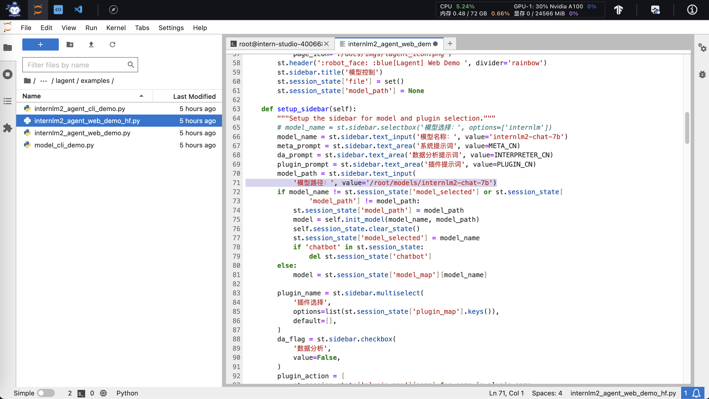
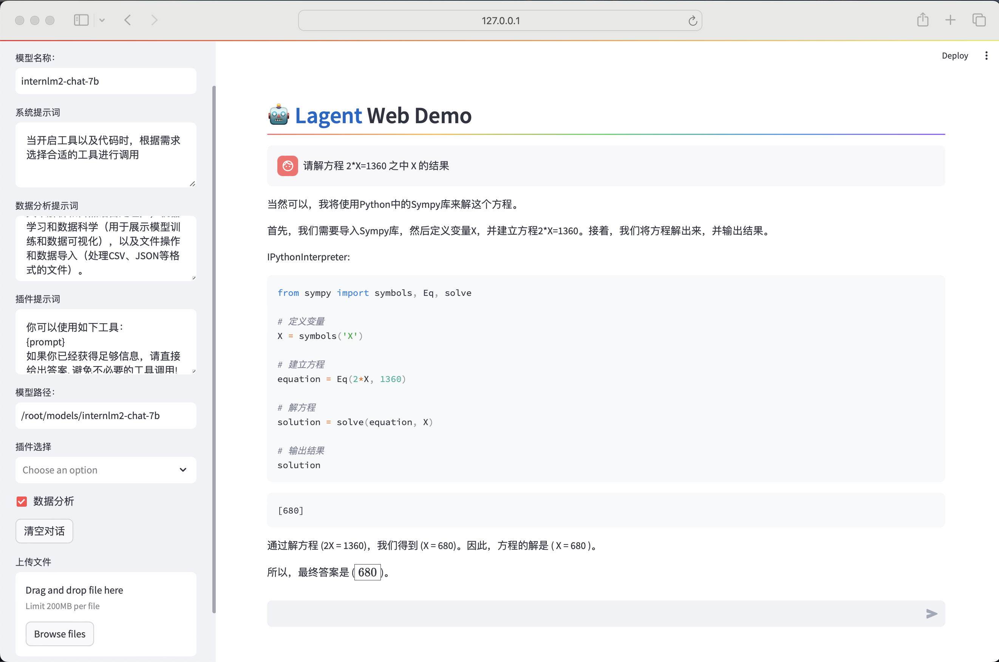
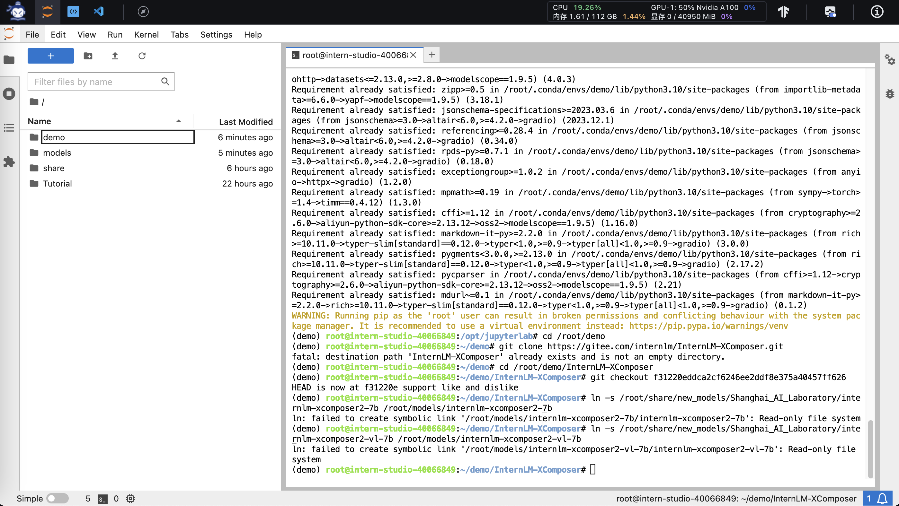

# 书生·浦语(InternLM)大模型实战Demo：编小故事、解数学方程、图文创作及图像问答

## 1. 使用 `InternLM2-Chat-1.8B` 模型生成 300 字的小故事

### 1.1 配置基础环境（使用 10% A100 开发机配置 ）
首先，打开 [`Intern Studio`](https://studio.intern-ai.org.cn/)界面，点击 `创建开发机` 配置开发机系统。


填写 `开发机名称` 后，点击 选择镜像 使用 `Cuda11.7-conda` 镜像，然后在资源配置中，使用 `10% A100 * 1` 的选项，点击`立即创建`，然后点击 `进入开发机` 选项。


进入开发机后，在Launcher中点击`Terminal`选项打开`termimal`终端窗口，在 `terminal` 中输入环境配置命令 (配置环境时间较长，需耐心等待)：

```bash
studio-conda -o internlm-base -t demo
```


配置完成后，进入到新创建的 `conda` 环境之中：

```bash
conda activate demo
```

输入以下命令，完成环境包的安装：

```bash
pip install huggingface-hub==0.17.3
pip install transformers==4.34
pip install psutil==5.9.8
pip install accelerate==0.24.1
pip install streamlit==1.32.2
pip install matplotlib==3.8.3
pip install modelscope==1.9.5
pip install sentencepiece==0.1.99
```

### 1.2 下载 `InternLM2-Chat-1.8B` 模型

按路径创建文件夹，并进入到对应文件目录中：

```bash
mkdir -p /root/demo
touch /root/demo/cli_demo.py
touch /root/demo/download_mini.py
cd /root/demo
```


通过左侧文件夹栏目，双击进入 `demo` 文件夹，双击打开 `/root/demo/download_mini.py` 文件，复制以下代码：

```python
import os
from modelscope.hub.snapshot_download import snapshot_download

# 创建保存模型目录
os.system("mkdir /root/models")

# save_dir是模型保存到本地的目录
save_dir="/root/models"

snapshot_download("Shanghai_AI_Laboratory/internlm2-chat-1_8b",
                  cache_dir=save_dir,
                  revision='v1.1.0')

```


执行命令，下载模型参数文件：

```bash
python /root/demo/download_mini.py
```

### 1.3 运行 cli_demo

双击打开 `/root/demo/cli_demo.py` 文件，复制以下代码：

```python
import torch
from transformers import AutoTokenizer, AutoModelForCausalLM


model_name_or_path = "/root/models/Shanghai_AI_Laboratory/internlm2-chat-1_8b"

tokenizer = AutoTokenizer.from_pretrained(model_name_or_path, trust_remote_code=True, device_map='cuda:0')
model = AutoModelForCausalLM.from_pretrained(model_name_or_path, trust_remote_code=True, torch_dtype=torch.bfloat16, device_map='cuda:0')
model = model.eval()

system_prompt = """You are an AI assistant whose name is InternLM (书生·浦语).
- InternLM (书生·浦语) is a conversational language model that is developed by Shanghai AI Laboratory (上海人工智能实验室). It is designed to be helpful, honest, and harmless.
- InternLM (书生·浦语) can understand and communicate fluently in the language chosen by the user such as English and 中文.
"""

messages = [(system_prompt, '')]

print("=============Welcome to InternLM chatbot, type 'exit' to exit.=============")

while True:
    input_text = input("\nUser  >>> ")
    input_text = input_text.replace(' ', '')
    if input_text == "exit":
        break

    length = 0
    for response, _ in model.stream_chat(tokenizer, input_text, messages):
        if response is not None:
            print(response[length:], flush=True, end="")
            length = len(response)

```

输入命令，执行 Demo 程序：

```bash
conda activate demo
python /root/demo/cli_demo.py
```

等待模型加载完成，键入内容示例：

    请创作一个 300 字的小故事

效果如下：


## 2. 使用 `huggingface_hub` python包下载 `InternLM2-Chat-7B`

输入命令，安装 huggingface_hub 库：

```bash
pip install -U huggingface_hub
```


输入命令，创建`download_hf.py`文件：

```bash
touch /root/demo/download_hf.py
```

通过左侧文件夹栏目，双击进入 `demo` 文件夹，双击打开 `/root/demo/download_hf.py` 文件，复制以下代码：

```python
import os
from huggingface_hub import hf_hub_download

hf_hub_download(repo_id="internlm/InternLM2-Chat-7B", filename="config.json", local_dir = '/root/models/', resume_download = True)
```


执行命令，下载`InternLM2-Chat-7B`的`config.json`文件：

```python
python /root/demo/download_hf.py
```


通过左侧文件夹栏目，双击进入 `models` 文件夹，双击打开`/root/models/config.json`文件：


## 3. 使用`Lagent` 工具调用 `数据分析` Demo 部署

### 3.1  轻量级智能体框架 Lagent

Lagent 是一个轻量级、开源的基于大语言模型的智能体（agent）框架，支持用户快速地将一个大语言模型转变为多种类型的智能体，并提供了一些典型工具为大语言模型赋能。[Lagent框架图](https://github.com/InternLM/Tutorial/raw/camp2/helloworld/images/Lagent-1.png)如下:


Lagent 的特性总结如下：

- 流式输出：提供 stream_chat 接口作流式输出，本地就能演示酷炫的流式 Demo。
- 接口统一，设计全面升级，提升拓展性，包括：  
  - Model : 不论是 OpenAI API, Transformers 还是推理加速框架 LMDeploy 一网打尽，模型切换可以游刃有余；         
  - Action: 简单的继承和装饰，即可打造自己个人的工具集，不论 InternLM 还是 GPT 均可适配；        
  - Agent：与 Model 的输入接口保持一致，模型到智能体的蜕变只需一步，便捷各种 agent 的探索实现；  
- 文档全面升级，API 文档全覆盖。
- 支持多种类型的智能体能力
  - ReAct
  - ReWoo
  - AutoGPT

  - 灵活支持多种大语言模型
    - GPT-3.5/4
    - Hugging Face Transformers
    - InternLM
    - Llama
- 简单易扩展，支持丰富的工具
  - AI工具
    - 文生图
    - 文生语音
    - 图片描述
    - ...
  - 能力拓展
    - 代码解释器
    - 计算器
    - 搜索
    - ...
  - Rapid API
    - 出行API
    - 财经API
    - 体育资讯API
    - ...

### 3.2 配置基础环境（使用 30% A100 开发机配置 ）

打开 `Intern Studio` 界面，调节配置（必须在开发机关闭的条件下进行）：


重新开启开发机，输入命令，开启 conda 环境：

```bash
conda activate demo
```

打开文件子路径

```bash
cd /root/demo
```

使用 git 命令下载 Lagent 相关的代码库：

```bash
git clone https://gitee.com/internlm/lagent.git
cd /root/demo/lagent
git checkout 581d9fb8987a5d9b72bb9ebd37a95efd47d479ac
pip install -e . # 源码安装
```

运行效果如图：


### 3.3 使用 `Lagent` 运行 `InternLM2-Chat-7B` 模型为内核的智能体

打开 lagent 路径：

```bash
cd /root/demo/lagent
```

在 terminal 中输入指令，构造软链接快捷访问方式：

```bash
ln -s /root/share/new_models/Shanghai_AI_Laboratory/internlm2-chat-7b /root/models/internlm2-chat-7b
```


打开 `lagent` 路径下 `examples/internlm2_agent_web_demo_hf.py` 文件，并修改对应位置 (71行左右) 代码：



输入运行命令：

```bash
streamlit run /root/demo/lagent/examples/internlm2_agent_web_demo_hf.py --server.address 127.0.0.1 --server.port 6006
```


查询开发机端口（例如图中端口示例为 41135）：


再复制下方的密码：


打开Mac 系统终端，输入如下命令后按回车键，输入上面复制的密码按回车键：

```bash
# 从本地使用 ssh 连接 studio 端口
ssh -CNg -L 6006:127.0.0.1:6006 root@ssh.intern-ai.org.cn -p 41135
```

最终保持在如下效果即可：


打开 [http://127.0.0.1:6006](http://127.0.0.1:6006) 后，（会有较长的加载时间）勾上数据分析，其他的选项不要选择，进行计算方面的 Demo 对话，即完成本章节实战。键入内容示例：

    请解方程 2*X=1360 之中 X 的结果




## 4. `浦语·灵笔2` 的 `图文创作` 及 `视觉问答` 部署

### 4.1 浦语·灵笔2(`XComposer2` )

`浦语·灵笔2`(`XComposer2` ) 是基于 `书生·浦语2`(`InternLM2`) 大语言模型研发的突破性的图文多模态大模型，具有非凡的图文写作和图像理解能力，在多种应用场景表现出色。[`浦语·灵笔2`(`XComposer2`性能对比图 )](https://github.com/InternLM/Tutorial/raw/camp2/helloworld/images/Benchmark_radar_CN.png)如下:


`浦语·灵笔2`(`XComposer2` )  的特性总结如下：

- 自由指令输入的图文写作能力： `浦语·灵笔2` 可以理解自由形式的图文指令输入，包括大纲、文章细节要求、参考图片等，为用户打造图文并貌的专属文章。生成的文章文采斐然，图文相得益彰，提供沉浸式的阅读体验。
- 准确的图文问题解答能力：`浦语·灵笔2` 具有海量图文知识，可以准确的回复各种图文问答难题，在识别、感知、细节描述、视觉推理等能力上表现惊人。
- 杰出的综合能力： `浦语·灵笔2-7B` 基于 `书生·浦语2-7B` 模型，在13项多模态评测中大幅领先同量级多模态模型，在其中6项评测中超过 `GPT-4V` 和 `Gemini Pro`。

### 4.2 配置基础环境（使用 50% A100 开发机配置 ）

选用 `50% A100` 进行开发：


进入开发机，启动 `conda` 环境：

```bash
conda activate demo
# 补充安装环境包
pip install gradio timm==0.4.12 sentencepiece==0.1.99 markdown2==2.4.10 xlsxwriter==3.1.2 gradio==4.13.0 modelscope==1.9.5
```

下载 **InternLM-XComposer 仓库** 相关的代码资源：

```bash
cd /root/demo
git clone https://gitee.com/internlm/InternLM-XComposer.git
cd /root/demo/InternLM-XComposer
git checkout f31220eddca2cf6246ee2ddf8e375a40457ff626
```

在 `terminal` 中输入指令，构造软链接快捷访问方式：

```bash
ln -s /root/share/new_models/Shanghai_AI_Laboratory/internlm-xcomposer2-7b /root/models/internlm-xcomposer2-7b
ln -s /root/share/new_models/Shanghai_AI_Laboratory/internlm-xcomposer2-vl-7b /root/models/internlm-xcomposer2-vl-7b
```



### 4.3 图文创作实战

继续输入指令，用于启动 `InternLM-XComposer`：

```bash
cd /root/demo/InternLM-XComposer
python /root/demo/InternLM-XComposer/examples/gradio_demo_composition.py  \
--code_path /root/models/internlm-xcomposer2-7b \
--private \
--num_gpus 1 \
--port 6006
```


查询开发机端口（例如图中端口示例为 41135）：


再复制下方的密码：


打开Mac 系统终端，输入如下命令后按回车键，输入上面复制的密码按回车键：

```bash
# 从本地使用 ssh 连接 studio 端口
ssh -CNg -L 6006:127.0.0.1:6006 root@ssh.intern-ai.org.cn -p 41135
```

最终保持在如下效果即可：


打开 [http://127.0.0.1:6006](http://127.0.0.1:6006) ，输入`提示词`，点击`Submit(提交)`，实践效果如下图所示：


最后查看一下`开发机`中GPU资源利用情况：


可以看到，该图文创作任务的`开发机`中A100 GPU的显存占用大约有36GB。

### 4.4 图像问答实战

在`开发机`中运行 `gradio` 程序时，如果需要退出，需要按照[Terminal 终端清除方法图示](https://github.com/InternLM/Tutorial/raw/camp2/helloworld/images/check-3.png)中的步骤，在 `terminal` 栏目中点击关闭，然后再重新打开一个 `terminal` 以继续后面的实战。（否则会出现 `显存耗尽` 的情况）


根据上述方法，关闭并重新启动一个新的 `terminal`，继续输入指令，启动 `InternLM-XComposer2-vl`：

```bash
conda activate demo

cd /root/demo/InternLM-XComposer
python /root/demo/InternLM-XComposer/examples/gradio_demo_chat.py  \
--code_path /root/models/internlm-xcomposer2-vl-7b \
--private \
--num_gpus 1 \
--port 6006
```

打开 [http://127.0.0.1:6006](http://127.0.0.1:6006) (上传图片后) 键入内容示例如下：

    请分析一下图中内容

实践效果如下图所示：


## 5. 参考资料

- bilibili视频：[轻松玩转书生·浦语大模型趣味 Demo](https://www.bilibili.com/video/BV1AH4y1H78d)

- [InternLM｜书生·浦语](https://github.com/InternLM/InternLM)  : Official release of InternLM2 7B and 20B base and chat models. 200K context support. [internlm.intern-ai.org.cn/](https://internlm.intern-ai.org.cn/)

- [InternLM/Tutorial](https://github.com/InternLM/Tutorial/tree/camp2)  : 书生·浦语大模型实战营(第二期)。
