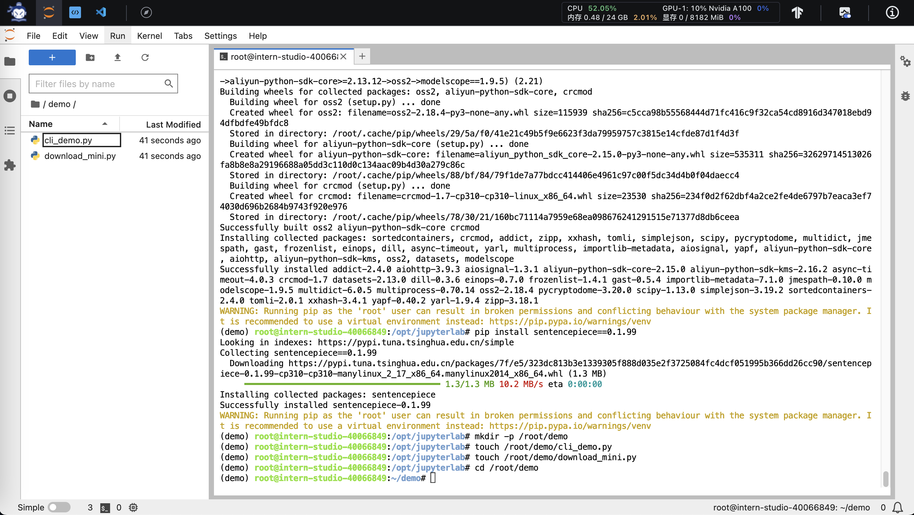

# 【上海AI Lab】轻松玩转书生·浦语大模型趣味 Demo学习笔记

## 1. 使用 `InternLM2-Chat-1.8B` 模型生成 300 字的小故事

### 1.1 配置基础环境
首先，打开 [`Intern Studio`](https://studio.intern-ai.org.cn/)界面，点击 创建开发机 配置开发机系统。


填写 `开发机名称` 后，点击 选择镜像 使用 `Cuda11.7-conda` 镜像，然后在资源配置中，使用 `10% A100 * 1` 的选项，点击`立即创建`，然后点击 `进入开发机` 选项。


进入开发机后，在Launcher中点击`Terminal`选项打开`termimal`终端窗口，在 `terminal` 中输入环境配置命令 (配置环境时间较长，需耐心等待)：

```bash
studio-conda -o internlm-base -t demo
```


配置完成后，进入到新创建的 `conda` 环境之中：

```bash
conda activate demo
```

输入以下命令，完成环境包的安装：

```bash
pip install huggingface-hub==0.17.3
pip install transformers==4.34
pip install psutil==5.9.8
pip install accelerate==0.24.1
pip install streamlit==1.32.2
pip install matplotlib==3.8.3
pip install modelscope==1.9.5
pip install sentencepiece==0.1.99
```

### 1.2 下载 `InternLM2-Chat-1.8B` 模型

按路径创建文件夹，并进入到对应文件目录中：

```bash
mkdir -p /root/demo
touch /root/demo/cli_demo.py
touch /root/demo/download_mini.py
cd /root/demo
```



通过左侧文件夹栏目，双击进入 `demo` 文件夹，双击打开 `/root/demo/download_mini.py` 文件，复制以下代码：

```python
import os
from modelscope.hub.snapshot_download import snapshot_download

# 创建保存模型目录
os.system("mkdir /root/models")

# save_dir是模型保存到本地的目录
save_dir="/root/models"

snapshot_download("Shanghai_AI_Laboratory/internlm2-chat-1_8b",
                  cache_dir=save_dir,
                  revision='v1.1.0')

```


执行命令，下载模型参数文件：

```bash
python /root/demo/download_mini.py
```

### 1.3 运行 cli_demo

双击打开 `/root/demo/cli_demo.py` 文件，复制以下代码：

```python
import torch
from transformers import AutoTokenizer, AutoModelForCausalLM


model_name_or_path = "/root/models/Shanghai_AI_Laboratory/internlm2-chat-1_8b"

tokenizer = AutoTokenizer.from_pretrained(model_name_or_path, trust_remote_code=True, device_map='cuda:0')
model = AutoModelForCausalLM.from_pretrained(model_name_or_path, trust_remote_code=True, torch_dtype=torch.bfloat16, device_map='cuda:0')
model = model.eval()

system_prompt = """You are an AI assistant whose name is InternLM (书生·浦语).
- InternLM (书生·浦语) is a conversational language model that is developed by Shanghai AI Laboratory (上海人工智能实验室). It is designed to be helpful, honest, and harmless.
- InternLM (书生·浦语) can understand and communicate fluently in the language chosen by the user such as English and 中文.
"""

messages = [(system_prompt, '')]

print("=============Welcome to InternLM chatbot, type 'exit' to exit.=============")

while True:
    input_text = input("\nUser  >>> ")
    input_text = input_text.replace(' ', '')
    if input_text == "exit":
        break

    length = 0
    for response, _ in model.stream_chat(tokenizer, input_text, messages):
        if response is not None:
            print(response[length:], flush=True, end="")
            length = len(response)

```

输入命令，执行 Demo 程序：

```bash
conda activate demo
python /root/demo/cli_demo.py
```

等待模型加载完成，键入内容示例：

    请创作一个 300 字的小故事

效果如下：

