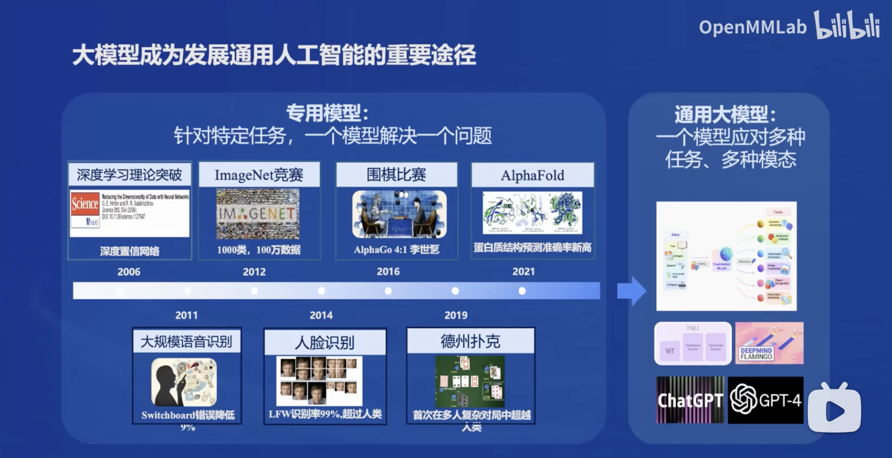
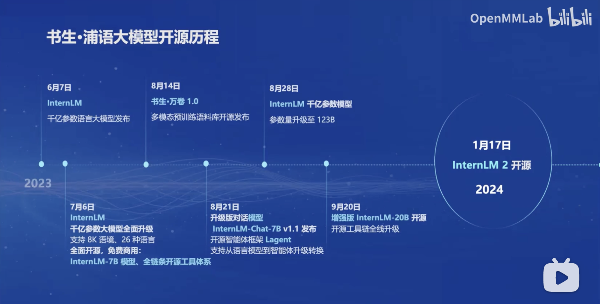
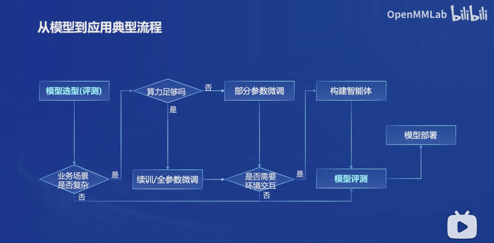

### 第一课 书生·浦语大模型全链路开源体系

#### 一、大模型成为发展通用人工智能的重要途径

 - 专用模型：针对特定任务，一个模型解决一个问题。
   - 2006年，深度学习理论突破（深度置信网络）。
   - 2011年，大规模语音识别。
   - 2012年，图像识别领域的ImageNet竞赛。
   - 2014年，人脸识别（LFW数据集上人脸识别率超过人类）。
   - 2016年，围棋比赛，AlphaGo战胜李世石。
   - 2019年，德州扑克首次在多人复杂对局转给你超越人类。
   - 2021年，AlphaFold蛋白质结构预测准确率新高。
 - 通用大模型：一个模型应对多种任务、多种模态。
   	1. 2023年，OpenAI的ChatGPT发布。

#### 二、书生·浦语大模型开源历程

 - 2023年6月7日，[InternLM](https://github.com/InternLM/InternLM)千亿参数语言大模型发布。
 - 2023年7月6日，InternLM千亿参数语言大模型全面升级，支持8K语境、26种语言。全面开源、免费商用：InternLM-7B、全链条开源工具体系。
 - 2023年8月14日，[书生·万卷1.0](https://github.com/opendatalab/WanJuan1.0)多模态预训练语料库开源发布。
 - 2023年8月21日，升级版对话模型InternLM-Chat-7B v1.1发布，开源智能体框架Lagent，支持从语言模型到智能体升级转换。
 - 2023年8月28日，InternLM 千亿参数模型的参数量升级到123B。
 - 2023年9月20日，增强版InternLM-20B开源，开源工具链全线升级。
 - 2024年1月17日，书生·浦语 2.0 (InterLM2) 开源。

#### 二、书生·浦语2.0（InternLM2)

##### （一）模型规格

- 7B模型：为轻量级的研究和应用提供了一个轻便但性能不俗的模型。
- 20B模型：模型的综合性能更为强劲，可有效支持更加复杂的实用场景。

##### （二）模型版本：面向不同的实用需求，每个规格包含三个模型版本。

- InternLM2-Base：高质量和具有很强可塑性的模型基座，是模型进行深度领域适配的高质量起点。
- InternLm2：在Base基础上，在多个能力方向进行了强化，在评测中成绩优异，同时保持了很好的通用语言能力，是我们推荐的在大部分应用中考虑选用的优秀基座。
- InternLM2-Chat：在Base基础上，经过SFT和RLHF，面相对话交互进行了优化，具有很好的指令遵循、共情聊天和调用工具等的能力。

##### （三）技术特色及亮点

- 新一代数据清洗过滤技术
  - 多维度数据价值评估：基于文本质量、信息质量、信息密度等维度对数据价值进行综合评估与提升。
  - 高质量语料驱动的数据富集：利用高质量语料的特征从物理世界、互联网以及语料库中进一步富集更多类似语料。
  - 有针对性的数据补齐：针对性补充语料，重点加强世界知识、数理、代码等核心能力。

- 超长上下文：模型在20万token上下文中，几乎完美实现“大海捞针”。
- 综合性能全面提升：推理、数学、代码提升显著，InternLM2-Chat-20B在重点评测上比肩ChatGPT（GPT-3.5）。
- 优秀的对话和创作体验：精准指令跟随，丰富的结构化创作，在AlpacaEval2超越GPT-3.5和Gemini Pro。
- 工具调用能力整体升级：可靠支持工具多轮调用，复杂智能体搭建。
- 突出的数理能力和实用的数据分析功能：强大的内生计算能力，加入代码解释后，在GSM8K和MATH达到和GPT-4相仿水平。

##### （四）从模型到应用典型流程

#### 三、书生·浦语全链条开源开放体系

##### （一）数据：书生·万卷

- 数据集获取方式
  - [OpenDataLab](https://opendatalab.org.cn/) : 为大模型提供高质量的开放数据集！

- 书生·万卷1.0
  - 总数据量：2TB
  - 发布日期：2023年8月14日
  - 多模态融合
    - 包含文本、图像、视频等多模态数据
    - 涵盖科技、文学、媒体、教育和法律等多个领域
  - 精细化处理
    - 语言筛选
    - 文本提取
    - 格式标准化
    - 数据过滤和清洗（基于规则和模型）
    - 多尺度去重和数据质量评估等
  - 价值观对齐
    - 数据内容与主流中国价值观进行对齐
    - 通过算法和人工评估的结合提高语料库的纯净度

- 书生·万卷CC

  - 总数据量：400GB

  - 发布日期：2024年3月6日

  - 三大优势
    - 时间跨度长：横跨了2013~2023年互联网公开内容
    - 来源丰富多样
    - 安全密度高
  - 高质量语料驱动效率性能双提升
  - 四重“萃取“高质量数据
  - 数据质量高、模型更可靠

##### （二）预训练：InterLM-Train

- 并行训练，极致优化速度达到 3600 tokens/sec/gpu

##### （三）微调：XTuner

- 支持全参数微调，支持LoRA等低成本微调
- 适配多种生态
  - 多种微调算法，覆盖各类SFT场景
  - 支持加载HuggingFace、ModelScope模型或数据集
  - 自动优化加速
- 适配多种硬件
  - 训练方案覆盖NVIDIA 20系以上所有显卡
  - 最低只需8GB显存即可微调7B模型

##### （四）部署：LMDeploy

- LMDeploy提供大模型在GPU上部署的全流程解决方案，包括模型轻量化、推理和服务。
- 高效推理引擎
  - 持续批处理技巧
  - 深度优化的低比特计算kernels
  - 模型并行
  - 高效的k/v缓存管理机制
- 全链路部署，性能领先每秒生成 2000+ tokens

##### （五）评测：OpenCompass

- 2024年1月30日，OpenCompass 2.0司南大模型评测体系 正式发布。
  - CompassRank：中立全面的性能榜单
  - CompassKit：大模型评测全栈工具链
    - 数据污染检查
    - 更丰富的模型推理接入
      - 支持近20个商业模型API
      - 支持LMDeploy、vLLM、LightLLM等推理后端
    - 长文本能力评测
    - 中英文双语主观评测
  - CompassHub：高质量评测基准社区
- 广泛应用于头部大模型企业和科研机构
- 获得Meta官方推荐唯一国产大模型评测体系
- 社区支持最完善的评测体系之一，100+评测集，50万+题目。

##### （六）应用：智能体

- **轻量级智能体框架 Lagent**

  - 支持多种类型的智能体能力

    - ReAct
    - ReWoo
    - AutoGPT

    - 灵活支持多种大语言模型
      - GPT-3.5/4
      - Hugging Face Transformers
      - InternLM
      - Llama

  - 简单易扩展，支持丰富的工具
    - AI工具
      - 文生图
      - 文生语音
      - 图片描述
      - ...
      - 能力拓展
        - 代码解释器
        - 计算器
        - 搜索
        - ...
      - Rapid API
        - 出行API
        - 财经API
        - 体育资讯API
        - ...

- **多模态智能体工具箱 AgentLego**

  - 丰富的工具集合，尤其是提供了大量视觉、多模态相关领域的前沿算法功能。
  - 支持多个主流智能体系统，如LangChain，Transformers Agent，Lagent等。
  - 灵活的多模态工具调用接口，可以轻松支持各类输入输出格式的工具函数。
  - 一键式远程工具部署，轻松使用和调试大模型智能体。

#### 四、参考资料

- bilibili视频：[书生·浦语大模型全链路开源体系](https://www.bilibili.com/video/BV1Vx421X72D)

- [InternLM｜书生·浦语](https://github.com/InternLM/InternLM)  : Official release of InternLM2 7B and 20B base and chat models. 200K context support. [internlm.intern-ai.org.cn/](https://internlm.intern-ai.org.cn/)
